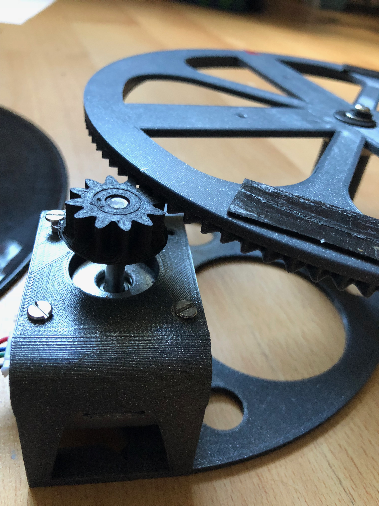
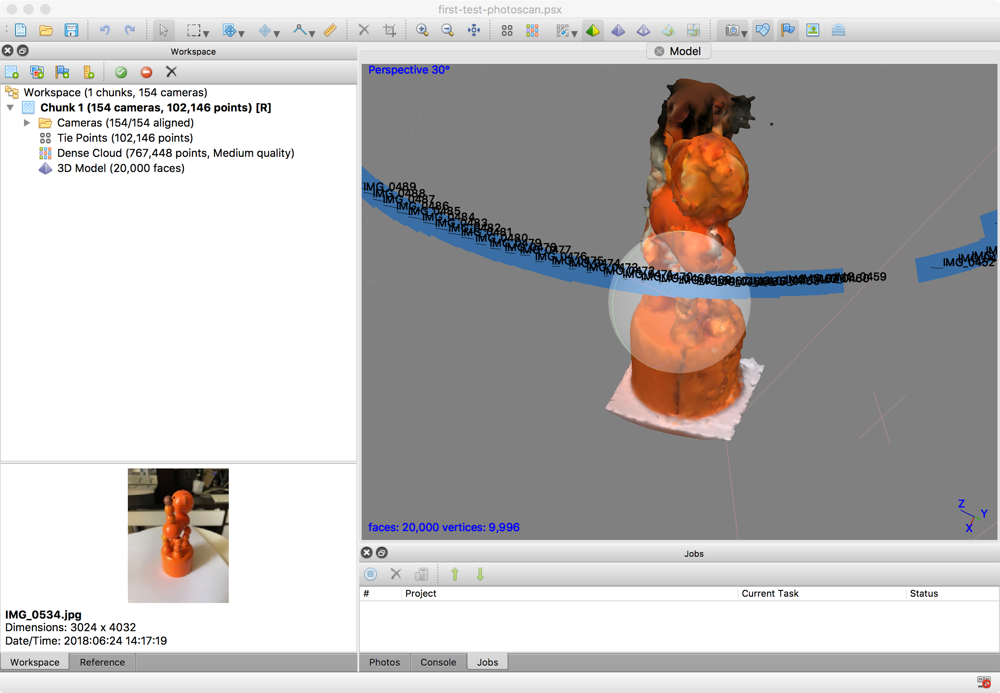

# UDP Snap

[See video](https://www.youtube.com/watch?v=fNixYq2eqGM&feature=youtu.be&a=)

Aim of this project is to provide iOS camera capture triggered by UDP commands from remote device.
In this example an ESP-8266 based rotary pad with H-L293N bridge, HS17 servo and some 3D printed parts.

## ESP8266

App for ESP8266 controls servo by advancing given steps in given interval, which is not exact in order to prevent vibrations.
Posts notifications on steps, so the iOS camera knows when is the right time to capture numbered step.

## iOS

* Minimal app in Swift 4 for iOS 11+, features latest photo capture APIs and server built on IBM's BlueSocket framework.
* App starts UDP server and performs camera capture directly to iCloud drive Documents when notified by ESP8266 client.
* UDP commands are received over WiFi from device acquired over MDNS on the same network.
* The communication is bi-directional, sending following commands: `PLAY`, `STOP`, `REWIND`.
* Client app is additionaly able to configure turntable jitter and time-lapse interval using commands `JIT:<Int, millis>` and `INT:<Int, seconds>`.

## Roadmap

* App should be able to reset container and/or order projects in folders in future.

# The Rig

You can find 3D source files in STL format inside the `rig` folder along with original SVGs for wheels. I'm not an industrial designer, so this is first drop, free to refactor.

* There's a known bug in the base where it's not entirely possible to insert servo without cutting a hole in the base. This will be fixed later.

* Also the large cog axis needs to be fastened against servo to fix wheels together safely and prevent skipping a step.

# Processing

You can use various tools to process captured photos. There's a new iOS app called Qlone, that works great with this rig... just stick the QR Code Matte to a vinyl record, drop onto the rig and adjust ESP code to make at lease 6 revolutions (Qlone captures not only 360° but also from 4 different side angles, while rendering the result in real time!).

I've been happy with free trial of Agisoft's [PhotoScan](http://www.agisoft.com) for MacOS (supports High Sierra).

For other platforms, you can use [3DF Zephyr](https://www.3dflow.net/3df-zephyr-free/) which is a free solution as well, but did not work on my version of OS X.

